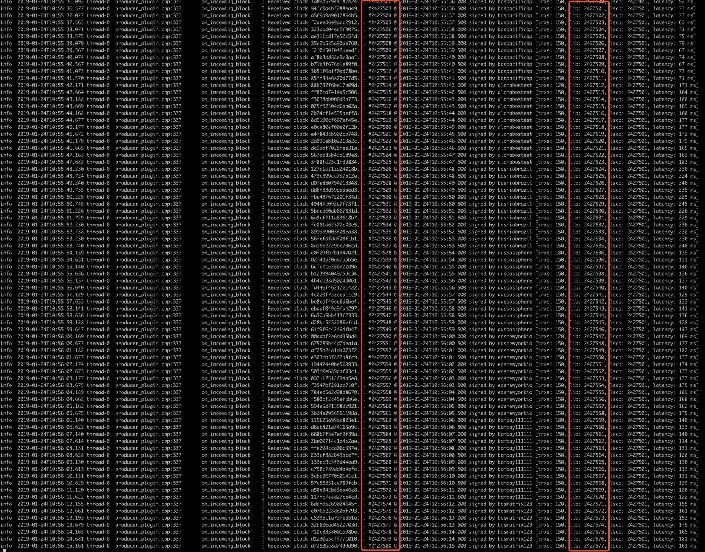
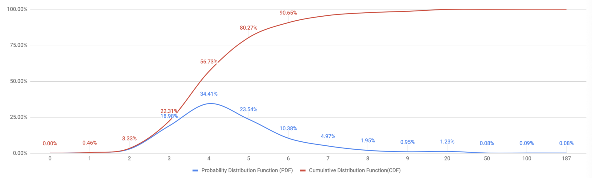
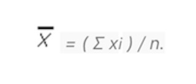
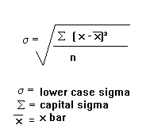
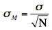

# PART I   BOS LIB Acceleration Solution
## 1. LIB Acceleration Introduction
### 1.1 LIB Introduction
Last Irreversible Block(LIB) describes the finality state of EOS. It is a consensus concept which guarantees immutability of blockchain. There are two major approaches to finality: one is probability-based and the other is signature-based.  Bitcoin is a classic probability-based finality example while EOS is signature-based. the difference details are worth another article but one is needed to be mentioned here in order to better understand LIB Acceleration solution: block producers are pre-determined in EOS by DPOS instead of mining lottery in Bitcoin. This also can be understood as: if all/major delegated block producers in EOS agree one LIB proposal, the finality is made accordingly.
### 1.2 LIB Acceleration
In Pipelined BFT, BPs implicitly prepares/commits a target block by producing a new block and link to the target block. Therefore, each block producer can only do this every 21*6=126 seconds. A full round of consensus requires two rounds (one for prepare, the other for commit) which is 126 * 2 = 252 seconds. One optimization has been made because 1. one block is enough to send the implicit message 2. majority block producers are enough to guarantee LIB and there is no need to wait for a full round for all block producers. Therefore the actual time spend is reduced to 1 + 12 * 14 + 12 * 13 blocks = 325 blocks = 162.5 seconds ( this number is the minimum time required for LIB, however, if some blocks are missing, the block number 325 will be less but the time should remain the same.) 

In LIB Acceleration, the core difference to pipeline BFT is that we changed implicit BFT messages to explicit messages. The philosophy behind is to trade network overhead (space) to LIB efficiency (time).

In order to achieve the goal, two core optimizations have been made:
1. **DPOS and PBFT**:

In order to support the dynamic on-chain vote, DPOS and PBFT need to be integrated. Therefore, BP schedule changes have to be carefully designed and guaranteed correctness. For example, on-chain voting causes a BP schedule change from v10 to v11 and this action happens in block #10000. after block #10000 enters LIB, BPs V11 should take control and start to advance LIB while produce blocks. However, block #10000 can become LIB only if a majority of BPs v10 agrees. Furthermore, in an asynchronized network, there are non-negligible latencies and chances of dropping messages and blocks (such as micro-forks, the situation will be even worse if the block contains BP schedule change is dropped), which makes BP schedule transit even harder.

2. **Batch-PBFT**:

In origin PBFT, every block is processed one by one. This is obviously not efficient when in EOS blocks are produced constantly every half seconds. Therefore, we optimized this part and allows each BP to prepare/commit batch by batch. There is no pre-defined batch size, each BP can batch as many as they can, which means the LIB catches up very fast when recovering from a bad network in certain circumstances.

## 2. DPOS Pipeline BFT vs DPOS Batch PBFT

The highlight features comparison is listed as follows:

|    | **DPOS Pipeline BFT**   | **DPOS Batch PBFT**   |
|:----|:----|:----|
| **time**   | ~162.5 seconds   | ~3 seconds   |
| **cpu/net overhead**   | N.A. (through blocks)   | CPU: constant overhead**, estimated around 8-10%   Net: constant overhead**, estimated equivalent to 42 transfer transactions    **The overhead is constant and is not sensitive to other factors such as TPS, network topology and block produce interval.   |
| **liveness**   | 100%, produce every 0.5 seconds   | 100%, produce every 0.5 seconds   |
| **safety**   | tolerable up to 6 byzantine nodes   | tolerable up to 6 byzantine nodes   |
| **safety in edge case**   | not safe, a hard fork may happen when two separate network exchange one bp each time   | safe, prepare and view change mechanism guarantee no hard fork happens   |
| **fork choice rule**   | longest fork wins   | longest fork with greatest supported weightage wins   |
| **micro forks**   | a single bp can act evil by drop previous bp's blocks    | the most accepted block wins, evil bp cannot simply drop previous bp's blocks.    |
| **block produce interval**   | LIB time doubles if interval changes from 0.5s to 1s   | not sensitive to interval value, possible to achieve LIB next block if the interval changes to 1s. it has been validated in private testnet and achieved > 16% TPS enhancement.    |

## 3. LIB Acceleration Benchmark

A benchmark has been made to test the performance of LIB Acceleration solution. An intuitive result description is listed below and detailed analysis is shown later.

| Head - LIB   | Cumulative Disctibution Function   |
|----:|----:|
| 5 blocks   | 80.17%   |
| 6 blocks   | 90.40%   |
| 7 blocks   | 95.51%   |
| 8 blocks   | 97.49%   |
| 9 blocks   | 98.49%   |
| 10 blocks   | 99.03%   |

### Benchmark Details
**Core Metric**:  
d, the difference count of blocks between HEAD and LIB.

**Benchmark Environment**:  
BOS LIB testnet is a public BOS-LIB testnet.  The testnet is hosted by more than 16 teams over the world. Till 28 Jan 2019, the testnet has produced 3 million blocks.
The latest implementation is open source and compatible with EOSIO version 1.4.4 and BOS-LIB.

**How to get raw data**:  
Raw data is collected using log when TPS is stable at 300 TPS, and 5 groups of 110k data points are collected.

**One Sample**:  
when TPS=300:  
**90.4% blocks enter LIB within 6 blocks**
**95.5% blocks enter LIB within 7 blocks**
**99.03% blocks enter LIB within 10 blocks**

**Confidence Interval**:  
We take 5 groups data and calculate CDF(cumulative distribution function) for 6 blocks and 10 blocks respectively, get the following data:  

|    | group 1   | group 2   | group 3   | group 4   | group 5   |
|:----|:----|:----|:----|:----|:----|
| CDF block 6   | 90.03   | 90.08   | 90.04   | 90.65   | 90.16   |
| CDF block 10   | 98.96   | 99.01   | 99.03   | 99.08   | 99.03   |

calculate the standard deviation and mean:

then we calculate a 95% confidence interval:

and get the result:  

| CDF block 6   | 90.192 ± 0.2 % (95% CI)   |
|:----|:----|
| CDF block 10   | 99.022 ± 0.034 % (95% CI)   |

**Conclusions**:  
When TPS = 300, we have 95% confidence to predicate that
90.192 ± 0.2% blocks enter LIB within 6 blocks
99.022 ± 0.034% blocks enter LIB within 10 blocks

**That means**:  
In 24 hours, most of the time(21.6 hours) blocks enter LIB within 3 seconds, while almost all the time (23.76 hours) blocks enter LIB within 5 seconds.

## 3. Future Improvements
1. upgrade compatible version to v1.6.x
1. system upgrade solution (discuss in part II)
1. optimize network message model, now is flooding mode.

## Reference  

- [BOS Technical White Paper](https://github.com/boscore/Documentation/blob/master/BOSCoreTechnicalWhitePaper.md)  
- [LIB Acceleration Design Document](https://github.com/eosiosg/dpos-pbft/blob/master/documentation/Algorithm%20for%20improving%20EOS%20consensus%20speed%20based%20on%20PBFT.md)  
